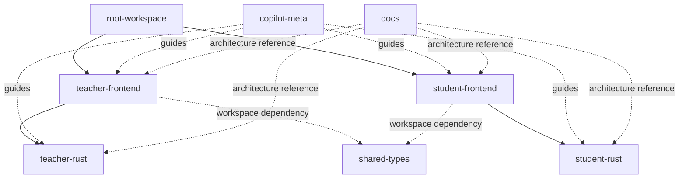
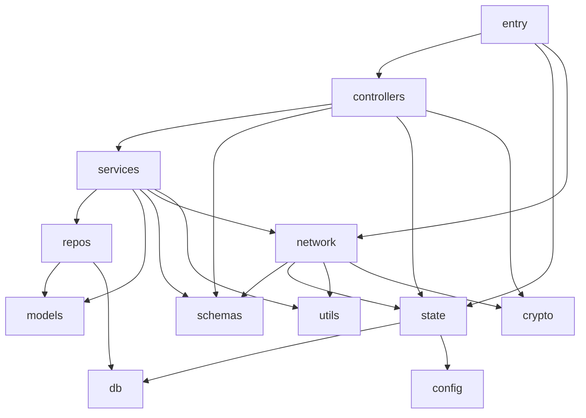
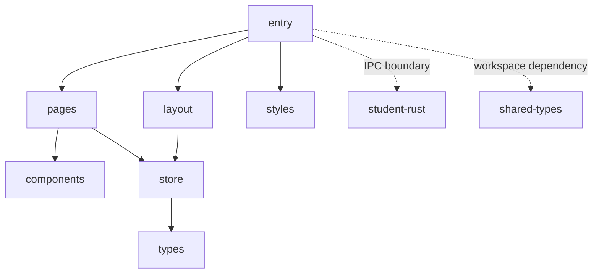
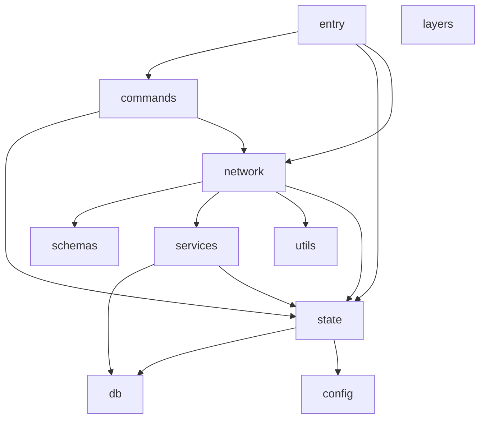

# 项目依赖图谱 — xs-examination

> 目的：帮助 Agent 在开始任务前快速恢复“模块边界、扇入、扇出、入口链路”。
>
> 范围：本图谱只基于目录结构、入口文件、模块声明、路由配置、`package.json` 与浅层 import / module export 关系整理，不下钻业务实现。

---

## 1. 使用方式

开始任务前，优先回答这 4 个问题：

1. 当前任务落在教师端还是学生端。
2. 当前任务落在前端、Rust 后端，还是共享类型包。
3. 变更入口是页面路由、Tauri IPC、后台网络任务，还是数据库/状态模块。
4. 需要关注的是声明依赖，还是当前已观测到的结构依赖。

---

## 2. 观测基线

本图谱主要依据以下结构入口整理：

- 根工作区：`package.json`
- 教师端前端：`apps/teacher/src/main.tsx` → `App.tsx` → `router/index.tsx`
- 教师端 Rust：`apps/teacher/src-tauri/src/main.rs` → `lib.rs`
- 学生端前端：`apps/student/src/main.tsx` → `App.tsx`
- 学生端 Rust：`apps/student/src-tauri/src/main.rs` → `lib.rs`
- 共享类型：`packages/shared-types/src/index.ts`
- AI 约束：`.copilot/AGENTS.md`、`.copilot/memorybank.md`

说明：下文的“扇入 / 扇出”以模块组为粒度，计数是结构级近似值，不是精确静态分析结果。

---

## 3. 工作区总览

### 3.1 顶层模块

| 模块 | 位置 | 角色 |
|------|------|------|
| root-workspace | `./` | pnpm monorepo 根，负责脚本编排 |
| teacher-frontend | `apps/teacher/src` | 教师端 React UI |
| teacher-rust | `apps/teacher/src-tauri/src` | 教师端 Tauri / Rust 后端 |
| student-frontend | `apps/student/src` | 学生端 React UI |
| student-rust | `apps/student/src-tauri/src` | 学生端 Tauri / Rust 后端 |
| shared-types | `packages/shared-types/src` | 前端共享类型出口 |
| docs | `doc` | PRD、技术设计、流程文档 |
| copilot-meta | `.copilot` | Agent 启动规范与项目记忆 |

### 3.2 顶层依赖图



### 3.3 顶层扇入 / 扇出

| 模块 | 扇入 | 扇出 |
|------|------|------|
| root-workspace | 0 | 2 个应用前端开发/构建脚本 |
| teacher-frontend | root-workspace、copilot-meta、docs | teacher-rust、shared-types、React 生态依赖 |
| teacher-rust | teacher-frontend、copilot-meta、docs | Tokio/Tauri/SeaORM/网络/状态模块 |
| student-frontend | root-workspace、copilot-meta、docs | student-rust、shared-types、React 生态依赖 |
| student-rust | student-frontend、copilot-meta、docs | Tauri/网络/状态/数据库模块 |
| shared-types | teacher-frontend、student-frontend（声明依赖） | 0 |
| docs | 0 | 为 4 个业务模块提供架构约束 |
| copilot-meta | 0 | 为 4 个业务模块提供任务入口约束 |

---

## 4. 教师端前端图谱

### 4.1 入口链

`main.tsx` → `App.tsx` → `router/index.tsx` → `layout/AppLayout.tsx` → `pages/*`

当前路由已观测页面：

- Dashboard
- Devices
- DeviceAssign
- ExamManage
- Students
- QuestionImport
- StudentImport
- Monitor
- Grading
- Report

### 4.2 模块分组

| 模块组 | 位置 | 说明 |
|------|------|------|
| entry | `main.tsx` / `App.tsx` | React 根入口与路由挂载 |
| router | `router/` | 页面路由汇聚 |
| layout | `layout/` | 应用骨架与导航 |
| pages | `pages/` | 页面级容器 |
| hooks | `hooks/` | 页面复用逻辑 |
| services | `services/` | Tauri IPC 封装层 |
| types | `types/` | 前端本地类型 |
| utils | `utils/` | 日期、Excel、校验、通用工具 |
| styles | `styles/` | 全局样式入口 |

### 4.3 结构依赖图

```mermaid
graph TD
    TMain[entry]
    TRouter[router]
    TLayout[layout]
    TPages[pages]
    THooks[hooks]
    TServices[services]
    TTypes[types]
    TUtils[utils]
    TStyles[styles]
    TauriAPI[@tauri-apps/api]
    Shared[shared-types]
    TeacherRS[teacher-rust]

    TMain --> TRouter
    TMain --> TStyles
    TRouter --> TLayout
    TRouter --> TPages
    TPages --> THooks
    TPages --> TServices
    TPages --> TTypes
    TPages --> TUtils
    THooks --> TServices
    THooks --> TTypes
    THooks --> TUtils
    TServices --> TTypes
    TServices --> TauriAPI
    TServices --> TeacherRS
    TMain -. workspace dependency .-> Shared
```

补充说明：

- `pages/DeviceAssign` 现在除了随机分配和清空分配，还会通过 `hooks/useDeviceAssign.ts` 调用新的连接与状态查询命令，把“已分配关系”和“真实连接状态”合并成表格行。
- `pages/Monitor` 现在不再只按 `ip_addr` 推导在线状态，而是通过 `hooks/useMonitor.ts` 复用同一套状态查询链路，确保与分配页口径一致。
- `pages/ExamManage` 现在不仅负责考试状态展示，还通过 `hooks/useExamManage.ts` 调用 `services/studentService.ts` 触发“分发试卷”与“开始考试”两条链路；其中“分发试卷”已形成教师端前端 -> 教师端 Rust -> 学生端控制服务 -> 学生端本地落库的完整闭环。
- 这意味着教师端前端里与“实时连接状态”最相关的页面已从单一的 `Monitor` 扩展为 `DeviceAssign + Monitor` 共享一套 `services -> teacher-rust` 调用路径。

### 4.4 扇入 / 扇出

| 模块组 | 扇入 | 扇出 |
|------|------|------|
| entry | 0 | router、styles |
| router | entry | layout、约 10 个 pages |
| layout | router | 页面插槽承载，不再向下依赖业务服务 |
| pages | router、layout | hooks、services、types、utils |
| hooks | pages、少量 hooks 互相复用 | services、types、utils |
| services | pages、hooks | `@tauri-apps/api/core`、types、teacher-rust |
| types | pages、hooks、services、utils | 基本无继续扇出 |
| utils | pages、hooks、types | 基本无继续扇出 |
| styles | entry | 0 |

### 4.5 快速定位

- 若任务是“页面展示/交互”，优先看 `pages/`、`hooks/`、`layout/`。
- 若任务是“前端调用 Rust 命令”，优先看 `services/`。
- 若任务是“页面表格数据形状”，优先看 `types/main.ts`。
- 若任务是“日期、Excel、表单校验”，优先看 `utils/`。

补充定位：

- 若任务是“分配页连接考生设备”，优先看 `pages/DeviceAssign`、`hooks/useDeviceAssign.ts`、`services/studentService.ts`。
- 若任务是“分配页/监考页连接状态不一致”，优先看 `hooks/useDeviceAssign.ts`、`hooks/useMonitor.ts`、`types/main.ts`。
- 若任务是“考试管理页分发试卷 / 开始考试”，优先看 `pages/ExamManage`、`hooks/useExamManage.ts`、`services/studentService.ts`。

### 4.6 说明

- `package.json` 中声明依赖了 `@xs/shared-types`，但当前已观测结构中前端源码主要仍在使用本地 `types/main.ts`。
- 因此，教师端前端对 `shared-types` 当前应视为“声明依赖强于实际结构依赖”。

---

## 5. 教师端 Rust 图谱

### 5.1 入口链

`main.rs` → `lib.rs` → `setup()` / `invoke_handler![]`

当前已观测到的启动点：

- `state::AppState::new(...)`
- 后台启动 `network::ws_server::start_ws_server(...)`
- Tauri IPC 注册多个 controller 命令

### 5.2 模块分组

| 模块组 | 位置 | 说明 |
|------|------|------|
| entry | `main.rs` / `lib.rs` | Tauri 启动与命令注册 |
| controllers | `controllers/` | Tauri 命令控制层 |
| services | `services/` | 业务服务层 |
| repos | `repos/` | 数据访问层 |
| models | `models/` | SeaORM/实体模型 |
| schemas | `schemas/` | DTO / 输入输出结构 |
| network | `network/` | WS、mDNS、学生控制通信 |
| state | `state.rs` | 应用共享状态 |
| db | `db/` | 连接与数据库基础设施 |
| config | `config.rs` | 配置读取 |
| crypto | `crypto.rs` | 加解密/签名能力 |
| utils | `utils/` | 通用工具 |

### 5.3 结构依赖图



### 5.4 扇入 / 扇出

| 模块组 | 扇入 | 扇出 |
|------|------|------|
| entry | teacher-frontend IPC、进程启动 | controllers、state、network |
| controllers | entry、teacher-frontend IPC | services、schemas、state、部分安全能力 |
| services | controllers | repos、models、schemas、network、utils |
| repos | services | models、db |
| models | repos、services | 0 |
| schemas | controllers、services、network | 0 |
| network | entry、services、controllers | schemas、state、utils、crypto |
| state | entry、controllers、network | db、config |
| db | repos、state | 0 |
| config | state | 0 |
| crypto | controllers、network | 0 |
| utils | services、network | 0 |

### 5.5 已观测控制层规模

`lib.rs` 当前注册的控制器组：

- `exam_controller`
- `device_controller`
- `student_controller`
- `student_exam_controller`
- `question_controller`
- `network_controller`

其中 `student_exam_controller` 当前除了原有“按考试查询学生/分配设备”命令外，还新增了两条直接服务于分配页和监考页的命令：

- `connect_student_devices_by_exam_id`
- `get_student_device_connection_status_by_exam_id`

同时，这个控制器组现在也承载考试管理页两条关键命令：

- `distribute_exam_papers_by_exam_id`
- `start_exam_by_exam_id`

这意味着当前教师端 Rust 的主要扇入集中在 `controllers/`，主要扇出集中在 `services/`、`network/`、`state/`。

### 5.6 快速定位

- 若任务是“前端 invoke 对应 Rust 命令”，先看 `controllers/`。
- 若任务是“业务规则 / 聚合流程”，先看 `services/`。
- 若任务是“实体持久化”，先看 `repos/`、`models/`、`db/`。
- 若任务是“WebSocket / mDNS / 控制分发”，先看 `network/`。

补充定位：

- 若任务是“按考试批量连接已分配设备”，先看 `controllers/student_exam_controller.rs`，再看 `network/student_control_client.rs`。
- 若任务是“真实连接状态四态聚合”，先看 `services/student_exam_service.rs` 与 `state.rs`。
- 若任务是“为什么终端有心跳但 UI 还是未连接”，先核对下发时 `payload.student_id` 是否使用了真实学生 `student_id`，而不是设备 `device_id`。
- 若任务是“发卷 0/x / 试卷分发失败”，先看 `controllers/student_exam_controller.rs`、`services/student_exam_service.rs`、`network/student_control_client.rs`，重点核对目标 `ip_addr`、控制端口和学生端 ACK。

---

## 6. 学生端前端图谱

### 6.1 入口链

`main.tsx` → `App.tsx` → `layout/AppLayout.tsx` → `pages/Exam/index.tsx`

当前学生端前端是单主页面结构，没有教师端那种完整路由树。

### 6.2 模块分组

| 模块组 | 位置 | 说明 |
|------|------|------|
| entry | `main.tsx` / `App.tsx` | React 根入口 |
| layout | `layout/` | 顶部头部与页面骨架 |
| pages | `pages/Exam/` | 考试主页面 |
| components | `components/ExamContent/` | 答题内容组件 |
| store | `store/` | Zustand 本地状态 |
| types | `types/` | 前端本地类型 |
| styles | `styles/` | 全局样式 |

### 6.3 结构依赖图



### 6.4 扇入 / 扇出

| 模块组 | 扇入 | 扇出 |
|------|------|------|
| entry | 0 | layout、pages、styles |
| layout | entry | store |
| pages | entry | components、store |
| components | pages | 0 或极少继续扇出 |
| store | layout、pages | types |
| types | store | 0 |
| styles | entry | 0 |

### 6.5 快速定位

- 若任务是“考试界面展示”，优先看 `pages/Exam/` 与 `components/ExamContent/`。
- 若任务是“头部信息与设备状态”，优先看 `layout/AppHeader.tsx` 与 `store/`。
- 若任务是“前端状态变更”，优先看 `store/examStore.ts`、`store/deviceStore.ts`。
- 若任务是“为什么学生端显示未收到试卷 / 已收到试卷”，优先看 `App.tsx`、`store/examStore.ts`、`services/examRuntimeService.ts`。

### 6.6 说明

- 学生端前端同样声明依赖了 `@xs/shared-types`，但当前结构扫描未看到明显实际 import。
- 当前结构更偏“单页考试壳 + 本地 store”，复杂度明显低于教师端前端。

---

## 7. 学生端 Rust 图谱

### 7.1 入口链

`main.rs` → `lib.rs` → `setup()` / `invoke_handler![]`

当前已观测后台启动点：

- `network::discovery_listener::start(...)`
- `network::control_server::start(...)`

当前已观测 IPC 命令：

- `test_db_connection`
- `connect_teacher_ws`
- `send_answer_sync`
- `get_ws_status`
- `get_current_exam_bundle`

### 7.2 模块分组

| 模块组 | 位置 | 说明 |
|------|------|------|
| entry | `main.rs` / `lib.rs` | 启动与命令注册 |
| commands | `commands.rs` | Tauri IPC 命令层 |
| network | `network/` | 发现、控制服务、WS 客户端 |
| services | `services/` | 业务服务，目前以教师端地址配置服务为主 |
| schemas | `schemas/` | 控制协议与网络协议结构 |
| state | `state.rs` | 应用共享状态 |
| db | `db/` | 本地数据库与实体 |
| config | `config.rs` | 配置读取 |
| utils | `utils/` | 时间等工具函数 |
| layers | `layers/` | 当前更偏占位/预留层 |
| controllers | `controllers/` | 当前目录存在但结构权重较低 |

### 7.3 结构依赖图



### 7.4 扇入 / 扇出

| 模块组 | 扇入 | 扇出 |
|------|------|------|
| entry | student-frontend IPC、进程启动 | commands、state、network |
| commands | entry、student-frontend invoke | state、network |
| network | entry、commands | schemas、services、utils、state |
| services | network | db、state |
| schemas | network | 0 |
| state | entry、commands、network、services | db、config |
| db | state、services | 0 |
| config | state | 0 |
| utils | network | 0 |
| layers | 当前结构扇入/扇出都很低，偏预留 |

### 7.5 快速定位

- 若任务是“学生端连接教师端 / 网络握手”，先看 `network/ws_client.rs`。
- 若任务是“学生端接收教师下发地址或控制消息”，先看 `network/control_server.rs`。
- 若任务是“本地缓存与地址持久化”，先看 `services/`、`db/`。
- 若任务是“IPC 命令与前端桥接”，先看 `commands.rs`。
- 若任务是“学生端为何收不到试卷”，先看 `network/control_server.rs`、`services/exam_runtime_service.rs`、`commands.rs`，确认 `DISTRIBUTE_EXAM_PAPER` 是否收到、`exam_sessions/exam_snapshots` 是否落库、`get_current_exam_bundle` 是否能读到数据。

---

## 8. shared-types 图谱

### 8.1 结构

`index.ts` 当前导出：

- `exam.ts`
- `protocol.ts`

### 8.2 扇入 / 扇出

| 模块 | 扇入 | 扇出 |
|------|------|------|
| shared-types | `apps/teacher/package.json`、`apps/student/package.json` 中声明 workspace 依赖 | `exam.ts`、`protocol.ts` 两个导出文件 |
| exam.ts | `index.ts` | 0 |
| protocol.ts | `index.ts` | 0 |

### 8.3 说明

- 从声明依赖看，`shared-types` 是跨端协议与核心业务类型的目标汇聚点。
- 从当前结构观测看，两端前端源码仍大量使用各自本地 `types/main.ts`，所以共享类型包仍处在“入口已预留、实际收敛未完成”的状态。

---

## 9. 声明依赖 vs 当前结构依赖

### 9.1 声明依赖

- 根工作区通过 pnpm script 调度教师端和学生端开发/构建。
- 教师端前端和学生端前端都在 `package.json` 中声明依赖 `@xs/shared-types`。
- 两端 Tauri Rust 后端各自通过 `lib.rs` 暴露内部模块。

### 9.2 当前已观测结构依赖

- 教师端前端的主边界是：`pages` → `hooks` / `services` → `@tauri-apps/api` → 教师端 Rust。
- 教师端 Rust 的主边界是：`entry` → `controllers` → `services` → `repos` / `models`。
- 学生端前端的主边界是：`App` / `layout` / `store` 的轻量结构。
- 学生端 Rust 的主边界是：`entry` → `commands` / `network` → `services` / `db`。
- `shared-types` 已具备跨端收敛位置，但当前实际代码耦合尚未完全收口到该包。

---

## 10. 快速任务分流建议

### 10.1 如果用户提到这些关键词，优先进入这些模块

| 关键词 | 首选模块 |
|------|------|
| 考试列表 / 考试创建 / 考试管理 | teacher-frontend `pages/` + `hooks/useExam*.ts` + `services/examService.ts` |
| 学生导入 / 学生分配 / 设备列表 | teacher-frontend `pages/Students*` / `pages/Devices*` + 对应 hooks/services |
| 实时监考 / 在线学生 | teacher-frontend `pages/Monitor` + teacher-rust `network/` + `controllers/network_controller.rs` |
| WebSocket / 心跳 / 广播 | teacher-rust `network/ws_server.rs` 或 student-rust `network/ws_client.rs` |
| 教师地址下发 / 控制服务 | student-rust `network/control_server.rs` + `services/teacher_endpoints_service.rs` |
| 本地数据库 / 迁移 / 实体 | 对应端的 `src-tauri/src/db/` 和 migrations |
| 时间工具 / 通用工具 | 对应端的 `src-tauri/src/utils/` 或前端 `src/utils/` |

补充关键词：

| 关键词 | 首选模块 |
|------|------|
| 连接考生设备 / 分配页一键连接 | teacher-frontend `pages/DeviceAssign` + `hooks/useDeviceAssign.ts` + teacher-rust `controllers/student_exam_controller.rs` |
| 连接状态四态 / 心跳超时 | teacher-rust `services/student_exam_service.rs` + `state.rs` + teacher-frontend `hooks/useDeviceAssign.ts` / `hooks/useMonitor.ts` |
| 心跳到了但 UI 未更新 | teacher-rust `controllers/student_exam_controller.rs` + `network/ws_server.rs`，重点检查 `student_id` 映射 |
| 分发试卷 / 发卷 0/x / 连接被拒绝 10061 | teacher-frontend `pages/ExamManage` + `hooks/useExamManage.ts` + `services/studentService.ts` + teacher-rust `services/student_exam_service.rs` + `network/student_control_client.rs` |
| 学生端未收到试卷 / 未显示已发卷 | student-rust `network/control_server.rs` + `services/exam_runtime_service.rs` + student-frontend `store/examStore.ts` + `App.tsx` |

---

## 11. 当前图谱结论

1. 教师端前端已经形成较明显的 `pages -> hooks -> services` 层次，是当前扇出最密集的前端模块。
2. 教师端 Rust 已形成 `controllers -> services -> repos/models` 的分层骨架，是当前扇入最集中的后端模块。
3. 学生端前端目前仍是轻量单页结构，依赖边明显少于教师端。
4. 学生端 Rust 的核心复杂度集中在 `network/`，而不是 `commands/`。
5. `shared-types` 是预期中的跨端收敛中心，但当前实际代码仍有较多本地类型分散。
6. `.copilot` 目录已经成为任务启动入口的一部分，开始任务前应同时阅读规范、记忆库和本图谱。
7. 教师端“实时连接状态”不再是 `Monitor` 页独有逻辑，而是 `DeviceAssign + Monitor` 共用的跨层链路：前端 hooks -> `studentService.ts` -> `student_exam_controller` -> `student_exam_service` -> `state.connections`。
8. 这条新链路的关键主键是 `student_id`，不是 `device_id`；如果连接下发或心跳聚合时混用两者，会出现“终端有心跳、UI 仍显示未连接”的典型错位问题。
9. “分发试卷”已确认是一条独立的跨端控制链路：教师端 `ExamManage/useExamManage/studentService` -> 教师端 `student_exam_controller/student_exam_service/student_control_client` -> 学生端 `control_server/exam_runtime_service` -> 学生端前端 `get_current_exam_bundle/examStore/App.tsx`。
10. 这条发卷链路与“连接考生设备”共用学生端控制端口，因此端口配置必须一致；连接阶段与发卷阶段若使用不同控制端口，会出现“已连接但发卷 0/x”或 `10061` 的典型断点。
