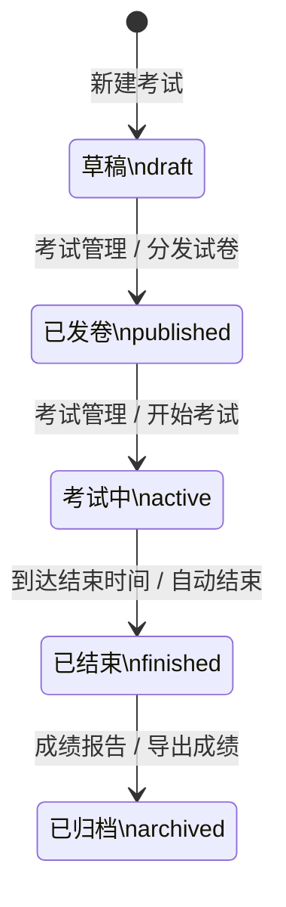

# 考试状态流转说明

本文档定义教师端考试状态的统一语义、触发条件与状态流转图，作为产品、前端、后端与测试对齐的基准。

## 1. 状态定义

| 状态码 | 展示文案 | 说明 |
|------|------|------|
| `draft` | 草稿 | 用于设置和编辑考试内容，包括基本信息、考试时间、题库与随机策略等。 |
| `published` | 已发卷 | 教师在考试管理中点击“分发试卷”后进入该状态，学生端会接收到教师端下发的试卷数据。 |
| `active` | 考试中 | 教师在考试管理中点击“开始考试”后进入该状态，学生端会接收到开始考试指令并进入正式作答。 |
| `finished` | 已结束 | 考试到达结束时间后自动切换到该状态；系统会向学生端发送停止考试指令，并停止接收学生端后续同步的作答选项。 |
| `archived` | 已归档 | 教师在成绩报告中导出成绩后进入该状态，表示本场考试已经完成结果沉淀与归档。 |

## 2. 状态流转规则

1. 新建考试默认进入 `draft`。
2. 教师完成考试配置后，可在考试管理中执行“分发试卷”，状态切换为 `published`。
3. 教师确认学生端已完成收卷后，可执行“开始考试”，状态切换为 `active`。
4. 当考试达到设定结束时间时，系统自动将状态从 `active` 切换为 `finished`。
5. 教师在成绩报告页面导出成绩后，状态从 `finished` 切换为 `archived`。

## 3. 状态图

## 4. 实现约束

1. 状态码以英文常量为准，界面统一显示中文文案。
2. 当前版本不再使用 `paused` 状态。
3. 自动结束应以考试 `end_time` 为准，不能依赖人工点击“结束考试”。
4. `archived` 表示考试流程闭环完成，后续如需再次编辑或重开考试，应明确新增逆向流转规则，不应隐式修改当前定义。